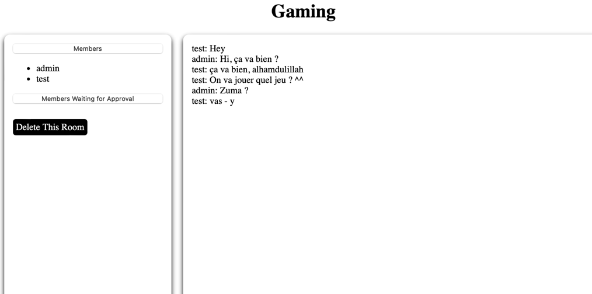
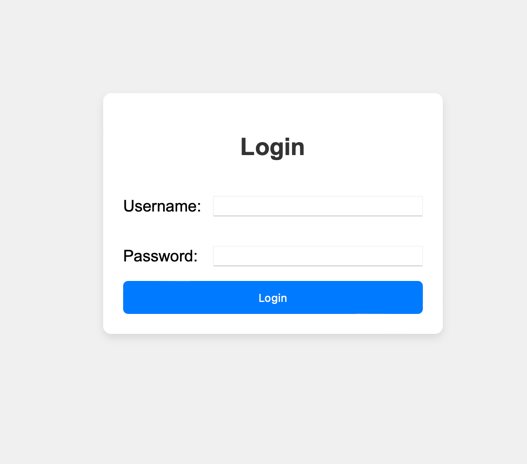
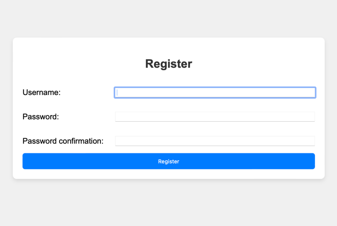
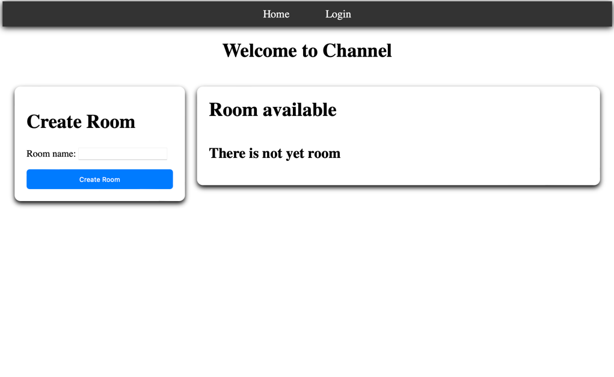

# ChatRealTime

This project allows me to learn about async function especially, django, and web.

## Table of Contents

- [Introduction](#introduction)
- [Installation](#installation)
  - [Prerequisites](#prerequisites)
  - [Steps](#steps)
- [Usage](#usage)
- [Features](#features)
- [Project Structure](#project-structure)
- [Contributing](#contributing)
- [License](#license)
- [Contact](#contact)

## Introduction

This project allows to do a chat, with possibility having multiple users connected. 

## Installation

### Prerequisites

Ensure you have the following installed:

- Python 3.x
- Django
- pip (Python package manager)
- Channels

### Steps

1. Clone the repository:
    ```bash
    git clone https://github.com/abisarwan-go/chatRealTime.git
    ```
2. Navigate into the project directory:
    ```bash
    cd yourproject
    ```
3. Create and activate a virtual environment:
    ```bash
    python -m venv venv
    source venv/bin/activate  # On Windows use `venv\Scripts\activate`
    ```
4. Install the required dependencies:
    ```bash
    pip install -r requirements.txt
    ```
5. Apply migrations:
    ```bash
    python manage.py migrate
    ```
6. Run the development server:
    ```bash
    python manage.py runserver
    ```

## Usage

## Features

- Real-time chat functionality
- User authentication
- Notifications
- Reject / Accept the demand of joining

## Project Structure

Provide an overview of your project's structure:
    ```
    chatRealTime/
    ├── authentification/
    ├── chatRealTime/
    ├── notifications/
    ├── progres/
    ├── room/
    ├── templates/
    ├── db.sqlite3
    ├── manage.py
    └── README.md
    ```

## Contributing

1. Fork the repository
2. Create a new branch (`git checkout -b feature-branch`)
3. Commit your changes (`git commit -m 'Add some feature'`)
4. Push to the branch (`git push origin feature-branch`)
5. Open a Pull Request

## License

This project is licensed under the MIT License - see the [LICENSE](LICENSE) file for details.

## Contact

Your Name - [abi.sarwan@etu.unistra.fr](mailto:abi.sarwan@etu.unistra.fr)

Project Link: [https://github.com/abisarwan-go/](https://github.com/abisarwan-go/)

## Screenshot

Here is a screenshot of the application
Chat Room

Login Page

Register Page

Empty room
